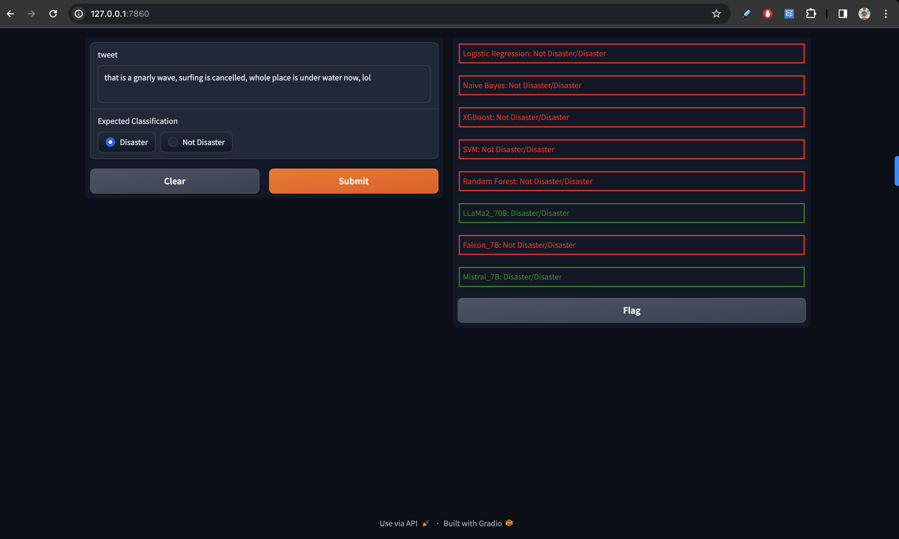

# NuanceNet: A Multilingual Speech Classification Model

This is the repository for the NuanceNet model, a multilingual speech classification model. In this project multiple AI models were used to classify tweet text into Disaster or Not Disaster tweets. The main goal was to capture the advantage of LLMs over traditional approaches when it comes to classification based on nuances, slangs and many more.

The classic ML models used in this project were:

1. [LogisticRegression](https://scikit-learn.org/stable/modules/generated/sklearn.linear_model.LogisticRegression.html)
2. [XGBoost](https://xgboost.readthedocs.io/en/latest/)
3. [SVM](https://scikit-learn.org/stable/modules/generated/sklearn.svm.SVC.html)
4. [RandomForest](https://scikit-learn.org/stable/modules/generated/sklearn.ensemble.RandomForestClassifier.html)
5. [NaiveBayes](https://scikit-learn.org/stable/modules/generated/sklearn.naive_bayes.MultinomialNB.html)

The LLMs used in this project were:

1. [Llama2](https://huggingface.co/transformers/model_doc/llama.html)
2. [Falcon](https://huggingface.co/transformers/model_doc/falcon.html)
3. [Mistral](https://huggingface.co/transformers/model_doc/mistral.html)

Along with LLMs, we also used RAG methodology to enable LLMs with few shot learning. The RAG model used in this project was: [ChromaDB](https://www.trychroma.com/)

## Dataset

The dataset used in this project was the [Disaster Tweets Dataset](https://www.kaggle.com/c/nlp-getting-started/data) from Kaggle. The dataset contains 7613 tweets that are classified into Disaster or Not Disaster tweets.

## Results

The accuracy results of the models are as follows:

1. LogisticRegression: 0.84
2. XGBoost: 0.87
3. SVM: 0.83
4. RandomForest: 0.86
5. NaiveBayes: 0.82
6. Llama2: 0.88
7. Falcon: 0.95
8. Mistral: 0.92

The classification report of the models are as follows:

| Model              | Precision(1) | Recall(1) | F1-Score(1) |
| ------------------ | ------------ | --------- | ----------- |
| LogisticRegression | 0.75         | 0.67      | 0.71        |
| XGBoost            | 0.80         | 0.63      | 0.71        |
| SVM                | 0.72         | 0.64      | 0.68        |
| RandomForest       | 0.78         | 0.61      | 0.69        |
| NaiveBayes         | 0.70         | 0.64      | 0.67        |
| Llama2             | 0.81         | 1.00      | 0.90        |
| Falcon             | 0.82         | 1.00      | 0.90        |
| Mistral            | 0.80         | 0.67      | 0.73        |

Snapshot of the demo:

## 

## Findings

1. The LLMs performed better than the classic ML models.
2. RAG models performed better than the LLMs.
3. Falcon model performed the best among all the models.

title: Nuancenet
emoji: 💻
colorFrom: pink
colorTo: blue
sdk: gradio
sdk_version: 4.11.0
app_file: app.py
pinned: false

---

Check out the configuration reference at https://huggingface.co/docs/hub/spaces-config-reference
